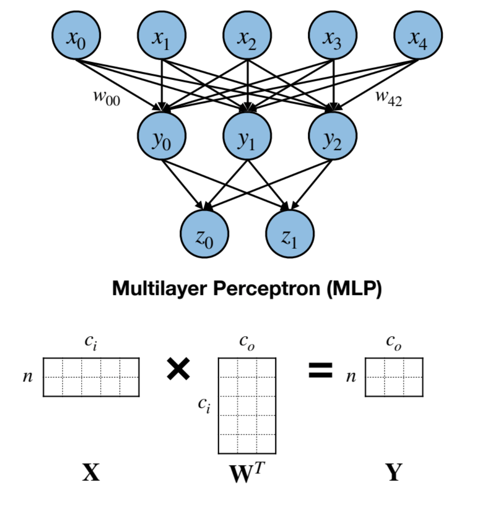
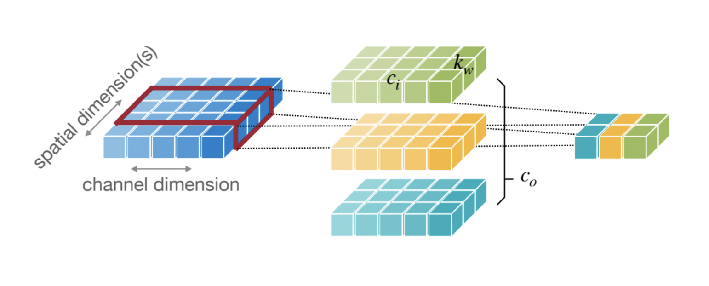

# Basics of Neural Networks

[Link](https://www.dropbox.com/scl/fi/pxvvqyq2yu6mwgk79bq5x/Lec02-Basics.pdf?rlkey=tsumfkhrglic55jnjs4yu66ni&e=4&st=cmwnvuvn&dl=0) to the original slides. 

## Neural Network Layers

### Fully Connected Layer 

    

      
    

    Every neuron in the output layer is connected to every other neuron in the previous layer, resulting in a dense weight matrix. 

    Input Features, X = (n, cᵢ)
    Weight Matrix, W = (cₒ, cᵢ)
    Output Features, Y = (n, cₒ)
    Bias, b = (cₒ)

    where, cᵢ = number of input channels, cₒ = number of output channels, and n = batch_size

### Convolutional Layer

#### 1D Convolutions

    

      
    

     Input Features, X = (n, cᵢ, wᵢ)
     Input Features, X = (n, cₒ, wᵢ)
     Weight Matrix, W = (n, cᵢ, wᵢ)

#### 2D Convolutions
#### Grouped Covolution
#### Depthwise Convolution
### Normalization Layer 
### Activation Function
### Transformers

## Latency vs Throughput

## Model Parameters
---
